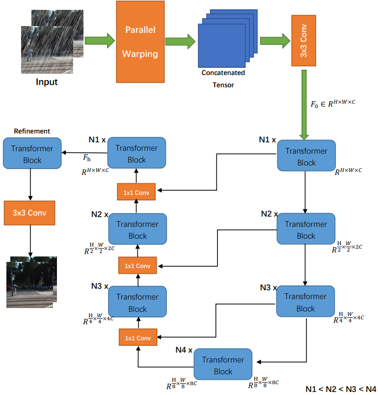

# Stereo Image Deraining with An Image Restoring Transformer



## Prerequisites
- Python >= 3.8  
- [Pytorch](https://pytorch.org/) >= 1.10  
- Torchvision >= 0.7  
- CUDA >= 11.2

## Introduction
- ```train.py``` is the codes for training the model.
- ```config_utils``` and ```utils``` contain the useful auxiliary functions.
- ```retrain``` defines the model structures.
- ```dataloaders``` contains modules which are used to load the training and validation/testing datasets.
- ```demo``` contains how you can test with the model.


## Quick Start

Ready the K12, K15 dataset

 - The training and testing datasets can be found (https://pan.baidu.com/s/1T2UplwARbLS5apIQiAnEXg
) (password : zzkd).

Ready the pretrain model
 - The pretrain model could be found (https://drive.google.com/drive/folders/1W6Ib6zWzaIuJBrfLaUIx00xC0CSgqtl1?usp=sharing)
 - Put the retrain model with the following folder
    ```
    ├── retrain
        └── pretrain
    ```


If you want to retrain the model, you can train the model by running the command below after setting the dataset path in ```dataloaders/__init__.py``` and config in ```train.sh```.

```bash
sh train.sh
```


## Training detail
#### Stereo :
   - K12 batch_size=4 epoch=20 learn_rate=0.001
   - K15 batch_size=4 epoch=20 learn_rate=0.001


## Acknowledgements
This repository makes liberal use of code from [Restormer] (https://github.com/swz30/Restormer).